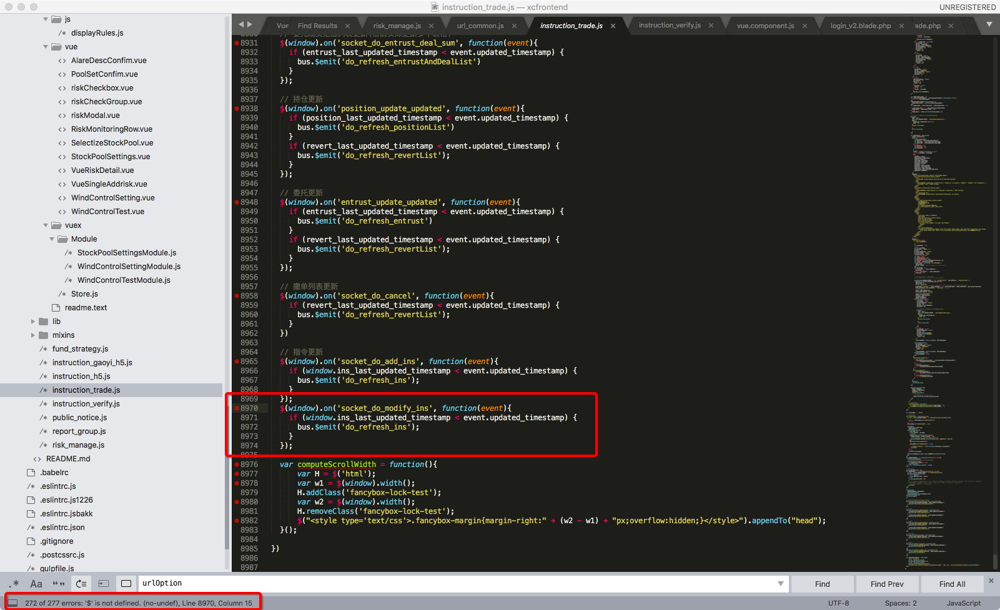

# eslint

----

## 关于

ESLint 是一个开源的 JavaScript 代码检查工具，由 Nicholas C. Zakas 于2013年6月创建。代码检查是一种静态的分析，常用于寻找有问题的模式或者代码，并且不依赖于具体的编码风格。对大多数编程语言来说都会有代码检查，一般来说编译程序会内置检查工具。

当开发人员数量不再限于三两个人时，一套统一的框架，编程思维，编程规范所节约的沟通成本是不需要多说的。更重要的是使用ESLint的过程中，我们能够接触到所有开发者所公认的代码规范，能够有机会学习并理解代码规范背后的原因。

## 规则

ESLint的规则分为：

1. "Possible Errors" // 可能导致错误

2. "Best Practices" // 最佳实践

3. "Strict Mode" // 严格模式相关

4. "Variables" // 变量定义相关

5. "Node.js and CommonJS" // node.js或者浏览器使用CommonJS

6. "Stylistic Issues" // 风格指南

7. "ECMAScript 6" // ES6，即ES2005相关

这些规则中，归纳出了一些推荐启用的规则，在文档中用绿色的勾标明出来；同样也有一部分规则是ESLint能够直接帮忙修改并修改的规则，这些规则通过特定字符串的修改即可，在文档中以黄色🔧符号表明出来。

## 规则示例

1. "no-cond-assign" 禁止在条件语句中出现赋值操作符
    在条件语句中，容易将一个比较运算符（像 ==）错写成赋值运算符（如 =）。
    为什么有这条规则？因为条件语句本身不应该处理赋值的事情，同时，如果在条件语句中不小心写成赋值操作符，定位问题会非常非常困难。

    
        // 找出数组中undefined的元素序号
        var arrA = [1,2,3,4,5,6,7,8,9,99];
        var funcA = function(arr){
            for(let i = 0; i < arr.length; i++){
              if(arr[i] = undefined){
                console.log(i)
              }
            }    
        };
        funcA(arrA);
    

    上面这一段代码乍看没什么问题，arrA数组中没有undefined的元素，所以不会console出任何东西。但是，在funcA执行完之后，arrA就被修改成了`[undefined, undefined, undefined, undefined, undefined, undefined, undefined, undefined, undefined, undefined]`;另外，当arrA是一个含有undefined元素的数组时（例如[1,2,3,undefined,5,6,7,8,9,99]），连结果都是错误的。

    在接触到ESLint之前，我所知道的一个解决这个问题的办法有一个，那就是定一条编程规范，判断语句中，变量应该在等号后面，而将常量放在等号之前。例如上面的代码中，只需要修改为“if(undefined = arr[i])”就可以了。改成这样，至少在测试的时候马上就可以看出这个函数不符合预期，也不会错误改到arrA的值。

2. "no-constant-condition" 禁止在条件中使用常量表达式
    将一个常量表达式（比如，一个字面值）作为一个测试条件可能是个书写错误或者为了触发某个特定的行为。
    一般来说，既然我们需要使用条件语句，那么这个语句不应该总是为false，或者总是为true。

    
        // 下面的这段代码看起来就是还没有准备好发布的，判断条件恒为false也就必定不会执行内部处理。
        if (false) {
            doSomethingUnfinished();
        }
    

    但是，在实际的代码中，存在这样的情况：永远需要执行的代码。例如服务器编程时有个永远执行的循环从套接字中获取数据，这样就能够处理网络上随时随地的请求了。
    在js中，像上面一样的永远执行的循环处理比较少见，但有构思一个队列机制，可以使用到永远执行的循环处理。前端队列算法，当getTimeout是一个回调处理函数时，可以采用以下代码处理。需要注意，forever函数内部，必须用“while (true)”而不能把内部的if判断条件提到while中。为什么请自行思考。

    
        var getTimeout = function(value){
            setTimeout(function(){
                console.log(value)
                loading = false;
                if(0 != arr.length){
                    doF();
                }
         
            }, 1000* value)
        }

        var arr = [4,3,2,1];
        function* forever(){
            while (true){
                if(arr.length > 0){
                    let a = arr.shift();
                    yield getTimeout(a);
                }else{
                    yield 0;
                }
         
            }
        }
        var d = forever();
        var loading = false;

        var addF = function(value){
            arr.push(value);
            doF();
        };

        var doF = function(){
            if(loading){
                return;
            }
            loading = true;
            var result = d.next();
            console.log(result)
            if(0 == result.value){
                loading = false;
            }
        }
        addF(2)
    

3. "no-fallthrough" 禁止 case 语句落空
    在 JavaScript 中，switch 语句是一种比较容易出错的结构，在某种程度上这要归功于 case 的落空能力。

    
        switch(foo) {
            case 1:
                doSomething();

            case 2:
                doSomethingElse();
        }
    

    在上面这段代码中，foo为1时，执行doSomething()的同时还会执行doSomethingElse()；
    当然，可以用break来阻止这样的情况。此规则也是为了避免忘了写break的。

    但是，当我们就是要像上面的代码一样，foo为1的情况下不要break呢？只需要在`case 1`的底部加上“// falls through”即可。

## 安装配置

下面是node环境的安装与配置。对于vue结尾的文件，我们还需要安装"eslint-config-vue"和"eslint-plugin-vue"插件。

1. npm install eslint --save-dev

2. ./node_modules/.bin/eslint --init

3. ./node_modules/.bin/eslint yourfile.js

eslint同样支持编辑器集成。例如sublime，安装sublimeLinter，以及SublimeLinter-contrib-eslint 即可。

## sublime上效果

