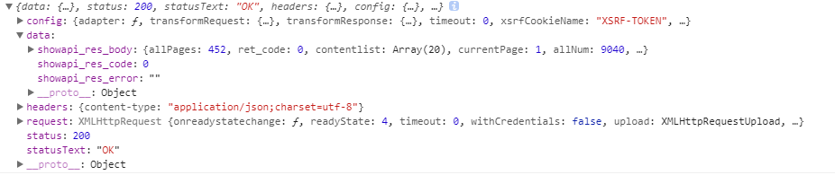
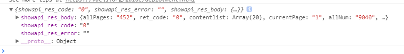
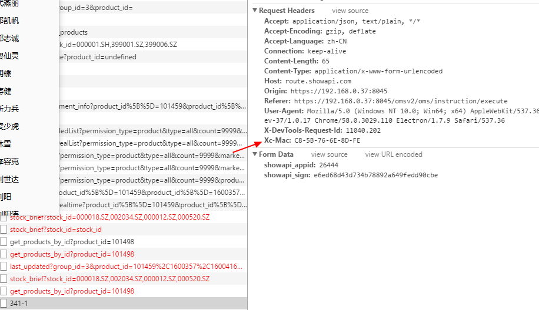

# axios 通用ajax请求
----
### 前言
基于 axios 模块 
[https://www.npmjs.com/package/axios](https://www.npmjs.com/package/axios);

做了一些额外处理：

- 返回结果。直接返回 data 数据
    1. 原始返回

    

    ----
    2. 处理之后的返回

    
- 返回结果，深度遍历，将数字转换为字符串（可看上图中的数字）

- 客户端中上报mac地址

  


### 使用方式
在入口文件中引入，并配置Vue.prototype。
```js
import Vue from "vue";
import Ajax from '@/webpack_js/lib/ajax/v1.0.0/index.js';

Vue.prototype.$http = Ajax;
```
之后可以在此入口文件之后的任意引入组件中使用 ```this.$http``` 来调用

#### 基础使用 ***(注意 get 与 post 时参数的传递差别  )***
```js
this.$http({
  method: 'post',   // get post ...
  url: 'https://route.showapi.com/341-1',
  data: {           // 参数
    showapi_appid: '26444',
    showapi_sign: 'e6ed68d43d734b78892a649fedd90cbe'
  }
}).then((res) => {
  console.log(res);
}).catch((err) => {
  console.log(err);
}).finally(() => {

})
```

```
this.$http({
  method: 'get',   // get post ...
  url: 'https://route.showapi.com/341-1',
  params: {        // 参数
    showapi_appid: '26444',
    showapi_sign: 'e6ed68d43d734b78892a649fedd90cbe'
  }
}).then((res) => {
  console.log(res);
}).catch((err) => {
  console.log(err);
}).finally(() => {

})
```

#### get请求
```js
/*
  get 请求方式
  注意注意：get 请求的参数 需要使用 params 包裹起来。  当然你也还是可以使用 url 地址拼接 参数的方式
*/
this.$http.get('https://route.showapi.com/341-1', {
  params: {
    showapi_appid: '26444',
    showapi_sign: 'e6ed68d43d734b78892a649fedd90cbe'
  },
}).then((data) => {
  // 成功的回调函数
  console.log(data);
}).catch((err) => {
  // 失败的回调函数
  console.log(err);
}).finally(() => {
  // 不管成功还是失败，最后都要走的回调函数
  console.log('不管成功还是失败，最后都要走的回调函数');
})
```

#### post请求
```js
/*
  post 请求方式
  注意注意： post 请求的参数 没有 params 了
*/
this.$http.post('https://route.showapi.com/341-1', {
  showapi_appid: '26444',
  showapi_sign: 'e6ed68d43d734b78892a649fedd90cbe'
}).then((data) => {
  console.log(data);
}).catch((err) => {
  console.log(err);
}).finally(() => {
  console.log('不管成功还是失败，最后都要走的回调函数');
})
```